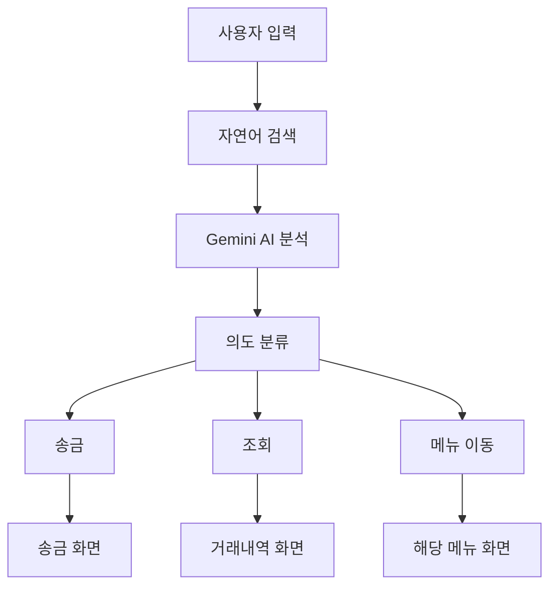

# SOL SEARCH - 은행앱의 자연어 검색 도구
> **"검색으로 하는 뱅킹"** - 기존의 딱딱한 키워드 검색이나 단순한 챗봇을 넘어서, 사용자의 자연스러운 말을 이해하고 즉시 실행까지 해주는 혁신적인 파워 검색 도구입니다.

> **[FE레포지토리](https://github.com/JunhyunKang/mock-sol)**


## ✨ 주요 특징

### 🗣️ **자연어 검색 시스템**
복잡한 메뉴를 찾아다닐 필요 없이 말하듯이 또는 기존 검색처럼 검색하세요
- **"홍길동 10만원 보내줘"** → 즉시 송금 화면으로 이동
- **"8월 출금내역"** → 해당 기간 거래내역 조회
- **"환율알림 설정"** → 환율알림 설정 화면으로 이동


### 🎯 **스마트 의도 분석**
LangChain + Google Gemini AI를 활용한 정확한 의도 파악
```
입력: "김네모에게 5만원 송금"
분석: ✅ 송금 의도 + 받는분(김네모) + 금액(50,000원)
결과: 송금 정보가 미리 입력된 상태로 화면 이동
```

## 🚀 주요 기능

| 기능 | 자연어 예시 | 설명 |
|------|------------|------|
| **💸 송금** | "박민수 2만원 보내줘" | 연락처 자동 인식 + 금액 입력 |
| **📊 거래내역 조회** | "최근 3개월 입금내역" | 기간/타입별 필터링 |
| **💱 환전** | "달러 환율 확인" | 실시간 환율 정보 |
| **💳 카드 관리** | "카드 신청하기" | 체크카드 신청 프로세스 |
| **🏠 대출 관리** | "대출 현황 보기" | 대출 정보 및 계산기 |

## 🏗️ 시스템 아키텍처



### 🔧 기술 스택
[](https://reactjs.org/)
[](https://www.typescriptlang.org/)
[](https://fastapi.tiangolo.com/)
[](https://ai.google.dev/)
[](https://langchain.com/)
#### **Frontend**
- **React 18** + **TypeScript** - 타입 안전한 UI 개발
- **Tailwind CSS** - 빠른 스타일링
- **Shadcn/ui** - 일관성 있는 컴포넌트
- **Lucide React** - 아이콘 시스템

#### **Backend**
- **FastAPI** - 고성능 Python API 서버
- **Pydantic** - 데이터 검증 및 직렬화
- **LangChain** - LLM 체인 구성 및 관리
- **Google Gemini AI** - 자연어 처리

#### **AI/NLP**
- **Google Gemini 2.0 Flash** - 의도 분석 및 개체명 추출
- **LangChain** - AI 체인 구성 및 프롬프트 엔지니어링
- **Custom Prompting** - 은행 업무 특화 프롬프트


## 📖 사용법

### 🔍 검색 예시

#### **송금**
```
"홍길동 10만원 보내줘"
→ 홍길동 계좌정보 자동 입력 + 금액 설정
```
 | 
:---: | :---:
기존 은행앱 송금 | 검색 기반의 송금


#### **거래내역 조회**
```
"8월 출금내역"
→ 2025년 8월 출금 거래만 필터링하여 표시
```
 | 
:---: | :---:
기존 은행앱 입출금 내역 조회 | 검색 기반의 입출금 내역 조회


#### **메뉴 이동**
```
"환율알림 설정하는 곳"
→ 환율알림 설정 화면으로 직접 이동
```


 | 
:---: | :---:
기존 은행앱 복잡한 메뉴 탐색 | 검색 기반의 메뉴 이동

 | 
:---: | :---:
기존 은행앱 복잡한 메뉴 탐색 | 검색 기반의 메뉴 이동

 | 
:---: | :---:
기존 은행앱 복잡한 메뉴 탐색 | 검색 기반의 메뉴 이동

 | 
:---: | :---:
기존 은행앱 복잡한 메뉴 탐색 | 검색 기반의 메뉴 이동

## 💡 핵심 혁신

### 🎪 **기존 은행 앱의 문제점**
- 복잡한 메뉴 구조로 원하는 기능 찾기 어려움
- 복잡한 메뉴와 용어로 어느 검색을 해야할 지 모호함
- "최근송금" 내역 외의 송금 기록에 있는 송금 시 매번 계좌정보 입력 필요
- 거래내역 조회 시 복잡한 필터 설정

### 🎪 **기존 은행 챗봇의 아쉬운 점**
- 챗봇 자체의 접근성이 낮음
- 정확한 키워드가 들어가야 검색가능
- 검색은 가능하지만 한번에 그 페이지까지 이동하는데 어려움이 있음
- 입출금 기간 필터, 송금 지원 불가

### ⚡ **SOL SEARCH의 해결책**
- **자연어 검색**으로 한 번에 원하는 기능 접근
- **AI 기반 정보 추출**로 번거로운 입력 과정 생략
- **스마트 필터링**으로 정확한 정보만 표시


## 🛠️ 설치 및 실행

### **Prerequisites**
- Node.js 18+
- Python 3.9+
- Google Gemini API Key

### **FE, BE 설치**
```bash
git clone https://github.com/JunhyunKang/mock-sol.git
git clone https://github.com/JunhyunKang/sol-search.git
```

### **pnpm 설치**
```bash
npm install -g pnpm
```

### **Frontend 실행**
```bash
cd mock-sol
pnpm install
pnpm run dev
```

### **Backend 실행**
```bash
cd sol-search
pip install -r requirements.txt
export GEMINI_API_KEY="your_api_key"
python run.py
```

## 🎯 향후 개발 계획

- [ ] **음성 검색** - 말로 직접 명령
- [ ] **개인화 AI** - 사용 패턴 학습
- [ ] **다국어 지원** - 영어, 중국어 지원
- [ ] **오픈뱅킹 연동** - 실제 은행 API 연결
- [ ] **생체 인증** - 지문, 얼굴 인식

## 🤝 기여하기

SOL SEARCH는 오픈소스 프로젝트입니다. 기여를 환영합니다!

1. Fork the Project
2. Create your Feature Branch (`git checkout -b feature/AmazingFeature`)
3. Commit your Changes (`git commit -m 'Add some AmazingFeature'`)
4. Push to the Branch (`git push origin feature/AmazingFeature`)
5. Open a Pull Request